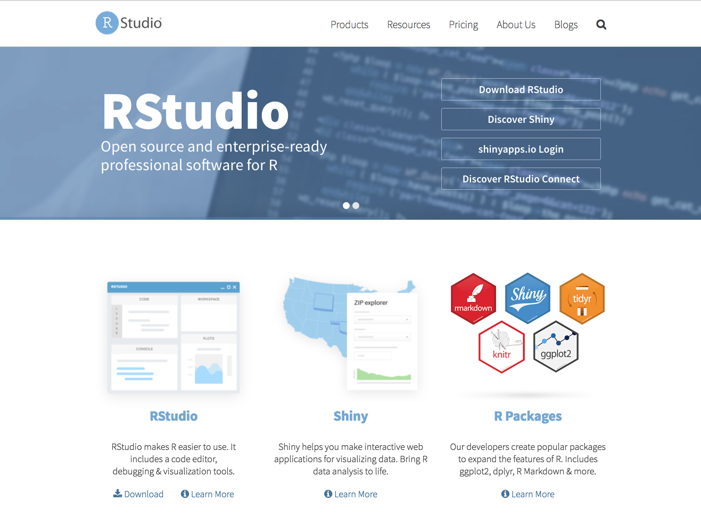

## Getting Started

### Download R
Click on the link to go to R's homepage. <https://www.r-project.org/>


To download R:

1. Click the **download R** link under Getting Started.
2. Select your CRAN mirror. Click one of the links at the top under 0-Cloud.
3. Click on the link that says "Download R for [Your Operating System]"
4. What to Pick
    - For Mac, select the latest release
    - For Windows, select base
    - For Linux, select your distribution and follow the instructions in the README.html file.
5. R should be downloaded to your computer and you should follow the normal steps to install

### Download RStudio

Click on the link to go to R's homepage. <https://www.rstudio.com/>



To download RStudio:

1. Click the Download link underneath the RStudio cartoon.
2. Click the DOWNLOAD button for the FREE RStudio Desktop.
3. Select your operating system from the list.
4. The file should download to your computer and then you can install it like any other program.

### Install Packages
To install the main packages that will be required for meetups, open RStudio and copy and paste the code below into the **Console**.

```r
install.packages(c('tidyverse', 'viridis', 'conflicted'))
```
If that doesn't work, copy and paste this code.

```r
packages <- c('dplyr', 'forcats', 'ggplot2', 'purrr', 'readr', 'stringr', 'tibble', 'tidyr', 'viridis', 'conflicted')
install.packages(packages)
```

### Install TeX

TeX is a computer language/program for typesetting, particulary for math and other technical typesetting. RStudio needs it installed on your computer in order to create PDFs from your R markdown documents. To install, follow the instructions for your operating system below.

**Mac:**

1. To install MacTeX, go here <http://www.tug.org/mactex/>
2. Click on MacTeX Download
3. Click on MacTeX.pkg
4. Install like any other program

Note: If you have RStudio open, you'll need to restart before you can knit a PDF.

**Windows:**

1. To install MiKTeX, go here <https://miktex.org/download>
2. Click Download
3. Execute the .exe files like normal
4. During installation select the options below. Otherwise install as you normally do. 
    - Install MiKTeX for anyone who uses the computer.
    - Install missing packages on-the-fly: Yes

Note: If you have RStudio open, you'll need to restart before you can knit a PDF.

**Linux:**

In terminal `sudo apt-get install texlive-full`

Note: If you have RStudio open, you'll need to restart before you can knit a PDF.

## Resources

Reference material used while creating material for meetups:

1. [R for Data Science](http://r4ds.had.co.nz/) by Hadley Wickham
2. [Advanced R](http://adv-r.had.co.nz/) by Hadley Wickham
3. Temple's BIO5312, [Biostatistics Fall 2017](http://sjspielman.org/bio5312_fall2017/) by Stephanie Spielman

---

# Content
### Week 1 (Sep 7)

- What's a meetup? / What's changing with meetups? [(slides)](week1/bioinformatics_meetup_introduction_2018.09.07.pdf)
- Getting Started (see section above)
- [Introduction to Rmarkdown](week1/intro_to_rmarkdown.Rmd)

Practice for the week is [here](week1/week1_intro_to_rmarkdown_practice.Rmd) and answers are [here in R markdown](week1/week1_intro_to_rmarkdown_practice_ANSWERKEY.Rmd) and [in html](week1/week1_intro_to_rmarkdown_practice_ANSWERKEY.html)

---

### Week 2 (Sep 14)

- Examining tables
- Subsetting
- Filtering and Selecting
- [Rmarkdown demo file](week2/examine_subset_filter_data.Rmd)

Practice for the week is [here](week2/wee2_practice_examine_filter_subset_data.Rmd) and answers are [here in Rmd](week2/wee2_practice_examine_filter_subset_data_ANSWERS.Rmd) and [in html](wee2_practice_examine_filter_subset_data_ANSWERS.html)

___

### Week 3 (Sep 21)

Plotting with ggplot2

- Background on ggplot and review data types
- Live demonstration of ggplot

Materials

- [slides]()
- ggplot demo [Rmd file]()
- ggplot [cheatsheet](https://www.rstudio.com/wp-content/uploads/2015/03/ggplot2-cheatsheet.pdf)
- Practice for the week is [here]()


<br><br>
<a rel="license" href="http://creativecommons.org/licenses/by-nc-sa/4.0/"></a><br />This work is licensed under a <a rel="license" href="http://creativecommons.org/licenses/by-nc-sa/4.0/">Creative Commons Attribution-NonCommercial-ShareAlike 4.0 International License</a>.
